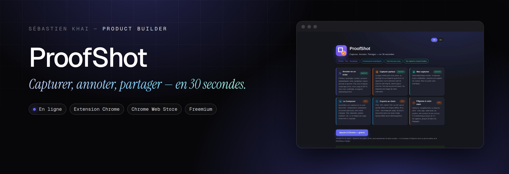
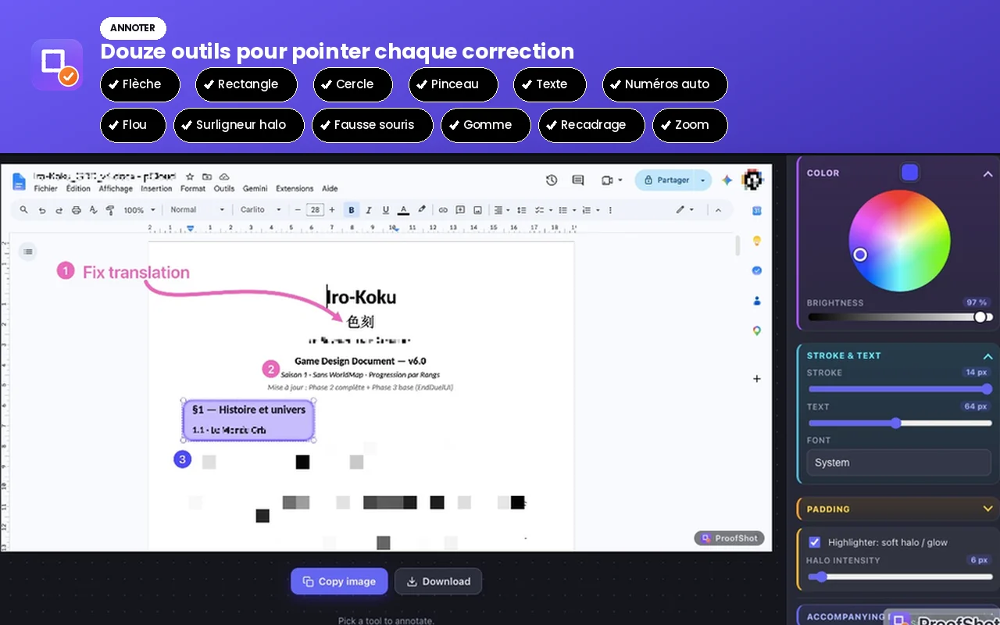
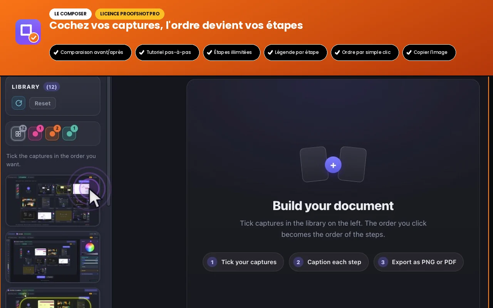

  
  
  

<h1 align="center">ProofShot</h1>

<b>Capturer, annoter, partager — en 30 secondes.</b> Une extension Chrome pour documenter un bug ou fabriquer un tutoriel sans quitter son navigateur. Et sans que vos captures ne quittent votre ordinateur.

---

### Le problème

Documenter un bug ou rédiger un tuto oblige à jongler entre capture, retouche et mise en page, souvent avec des outils qui envoient tout dans le cloud.

### L'idée

Tout au même endroit : capturer, annoter (flèches, flou, numéros), assembler des pas-à-pas ou des avant/après, exporter.

### Comment c'est fait

Extension 100 % locale, sans compte ni pistage, publiée sur le Chrome Web Store. Modèle freemium avec licence à vie : la seule connexion sortante vérifie la clé.

**Outils** &nbsp; `Extension Chrome` `Chrome Web Store` `Freemium`

### Aperçu

 

### Mentions

Ce dépôt héberge la page de présentation et la [politique de confidentialité](https://engob.github.io/proofshot/privacy.html) de l'extension, utilisée par le Chrome Web Store. Le code de l'extension n'y figure pas.

### English

**ProofShot** — *Capture, annotate, share — in 30 seconds.* A Chrome extension to document a bug or build a tutorial without leaving your browser — and without your screenshots ever leaving your computer.

Documenting a bug or writing a tutorial means juggling capture, editing and layout tools, often ones that upload everything to the cloud. Everything in one place: capture, annotate (arrows, blur, numbers), assemble step-by-steps or before/afters, export. A fully local extension, no account or tracking, published on the Chrome Web Store. Freemium with a lifetime licence: the only outgoing call checks the key.

---

Conçu, développé et mis en ligne par <b>Sébastien Khai</b>, Product Builder · <a href="https://engob.github.io/portofolio/">portfolio</a> · <a href="https://engob.github.io/portofolio/projets/proofshot/">fiche du projet</a> © 2026 Sébastien Khai — tous droits réservés.

